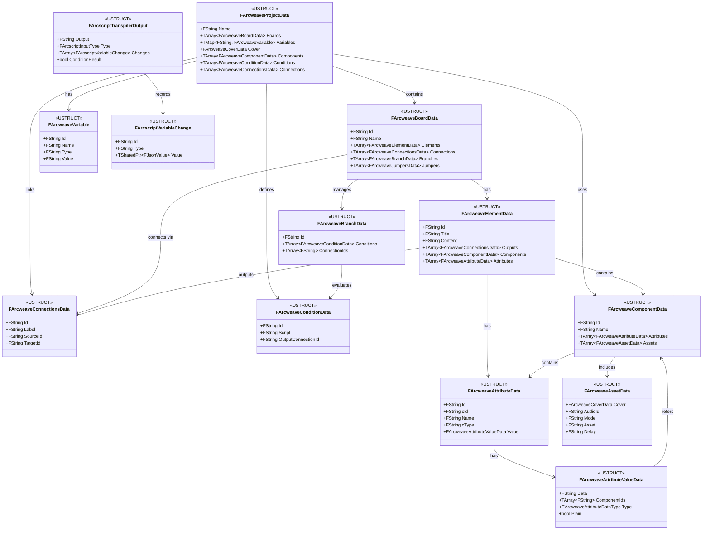

```mermaid


classDiagram

direction TB

   class FArcweaveProjectData {

    +FString Name

    +TArray\~FArcweaveBoardData\~ Boards

    +TMap\~FString, FArcweaveVariable\~ Variables

    +FArcweaveCoverData Cover

    +TArray\~FArcweaveComponentData\~ Components

    +TArray\~FArcweaveConditionData\~ Conditions

    +TArray\~FArcweaveConnectionsData\~ Connections

   }


   class FArcweaveBoardData {

    +FString Id

    +FString Name

    +TArray\~FArcweaveElementData\~ Elements

    +TArray\~FArcweaveConnectionsData\~ Connections

    +TArray\~FArcweaveBranchData\~ Branches

    +TArray\~FArcweaveJumpersData\~ Jumpers

   }


   class FArcweaveElementData {

    +FString Id

    +FString Title

    +FString Content

    +TArray\~FArcweaveConnectionsData\~ Outputs

    +TArray\~FArcweaveComponentData\~ Components

    +TArray\~FArcweaveAttributeData\~ Attributes

   }


   class FArcweaveConnectionsData {

    +FString Id

    +FString Label

    +FString SourceId

    +FString TargetId

   }


   class FArcweaveVariable {

    +FString Id

    +FString Name

    +FString Type

    +FString Value

   }


   class FArcweaveBranchData {

    +FString Id

    +TArray\~FArcweaveConditionData\~ Conditions

    +TArray\~FString\~ ConnectionIds

   }


   class FArcweaveConditionData {

    +FString Id

    +FString Script

    +FString OutputConnectionId

   }


   class FArcweaveComponentData {

    +FString Id

    +FString Name

    +TArray\~FArcweaveAttributeData\~ Attributes

    +TArray\~FArcweaveAssetData\~ Assets

   }


   class FArcscriptTranspilerOutput {

    +FString Output

    +FArcscriptInputType Type

    +TArray\~FArcscriptVariableChange\~ Changes

    +bool ConditionResult

   }


   class FArcweaveAttributeData {

    +FString Id

    +FString cId

    +FString Name

    +FString cType

    +FArcweaveAttributeValueData Value

   }


   class FArcweaveAssetData {

    +FArcweaveCoverData Cover

    +FString AudioId

    +FString Mode

    +FString Asset

    +FString Delay

   }


   class FArcscriptVariableChange {

    +FString Id

    +FString Type

    +TSharedPtr\~FJsonValue\~ Value

   }


   class FArcweaveAttributeValueData {

    +FString Data

    +TArray\~FString\~ ComponentIds

    +EArcweaveAttributeDataType Type

    +bool Plain

   }


<<USTRUCT>> FArcweaveProjectData

<<USTRUCT>> FArcweaveBoardData

<<USTRUCT>> FArcweaveElementData

<<USTRUCT>> FArcweaveConnectionsData

<<USTRUCT>> FArcweaveVariable

<<USTRUCT>> FArcweaveBranchData

<<USTRUCT>> FArcweaveConditionData

<<USTRUCT>> FArcweaveComponentData

<<USTRUCT>> FArcscriptTranspilerOutput

<<USTRUCT>> FArcweaveAttributeValueData

<<USTRUCT>> FArcweaveAttributeData

<<USTRUCT>> FArcweaveAssetData

<<USTRUCT>> FArcscriptVariableChange


   FArcweaveProjectData --> FArcweaveBoardData : contains

   FArcweaveProjectData --> FArcweaveVariable : has

   FArcweaveProjectData --> FArcweaveComponentData : uses

   FArcweaveProjectData --> FArcweaveConditionData : defines

   FArcweaveProjectData --> FArcweaveConnectionsData : links

   FArcweaveBoardData --> FArcweaveElementData : has

   FArcweaveBoardData --> FArcweaveConnectionsData : connects via

   FArcweaveBoardData --> FArcweaveBranchData : manages

   FArcweaveBranchData --> FArcweaveConditionData : evaluates

   FArcweaveElementData --> FArcweaveConnectionsData : outputs

   FArcweaveElementData --> FArcweaveComponentData : contains

   FArcweaveElementData --> FArcweaveAttributeData : has

   FArcweaveComponentData --> FArcweaveAttributeData : contains

   FArcweaveComponentData --> FArcweaveAssetData : includes

   FArcscriptTranspilerOutput --> FArcscriptVariableChange : records

   FArcweaveAttributeValueData --> FArcweaveComponentData : refers

   FArcweaveAttributeData --> FArcweaveAttributeValueData : has

```

