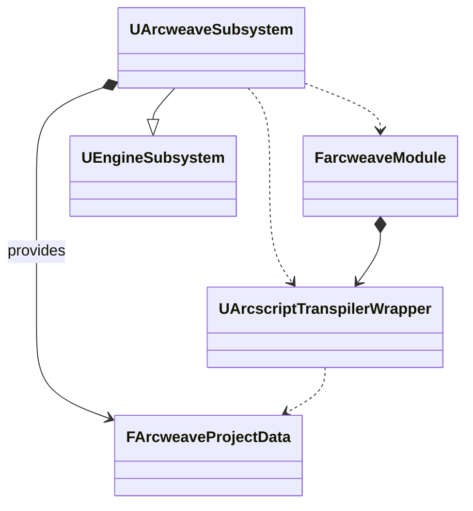
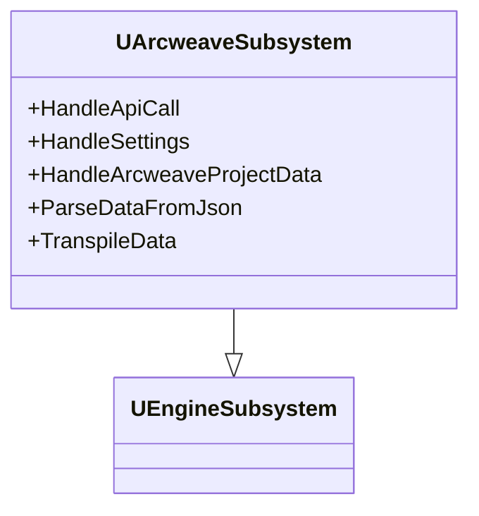
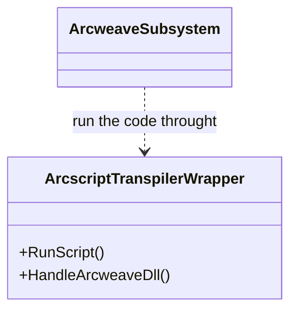
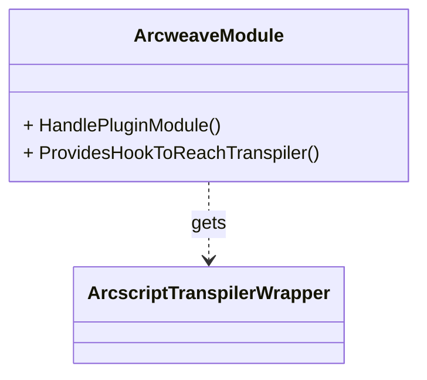
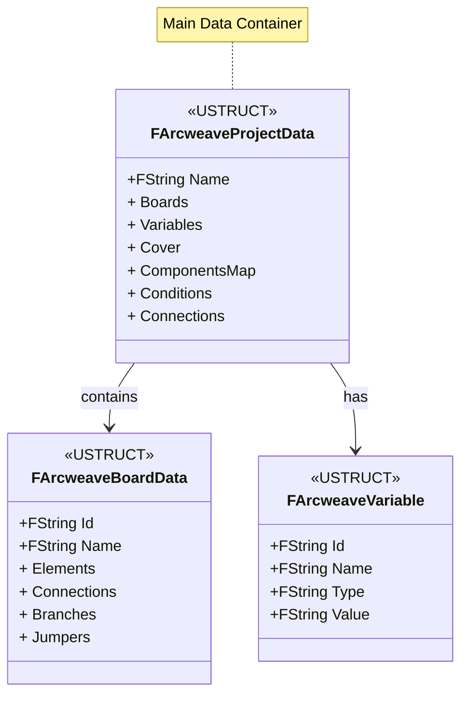
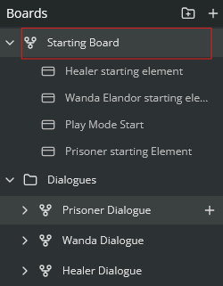
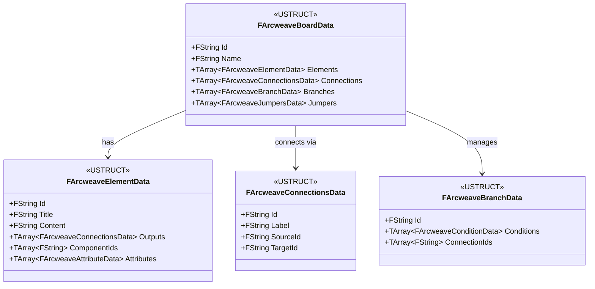

# Arcweave Plugin for Unreal Engine

[](https://github.com/arcweave/arcweave-unreal-plugin)
[](https://www.unrealengine.com/)
[](https://isocpp.org/)
[](LICENSE)
[](https://github.com/arcweave/arcweave-unreal-plugin/issues)
[](https://discord.gg/kb4FxBxw)
[](https://www.youtube.com/playlist?list=PLP2s5PcDiBdYRg0zHpJTuiDVf9JF_inyH)

[](https://www.youtube.com/watch?v=Ws_Cz-IQQYg)

This is the official README file for the Arcweave plugin repository, which facilitates the import of [Arcweave](https://arcweave.com/) projects into Unreal Engine (version 5.0 and later). 
The plugin can import data from an exported Arcweave JSON file (available to all Arcweave users) or it can directly utilize Arcweave's web API to fetch data, a feature available to Arcweave Team account owners. You can watch a [full video tutorial series](https://www.youtube.com/playlist?list=PLP2s5PcDiBdYRg0zHpJTuiDVf9JF_inyH) on how to install and use the plugin.

## Table of Contents

- [Plugin Installation](#plugin-installation)
- [Packaging](#packaging) 
- [Data Collection Methods](#data-collection-methods)
   - [JSON Import](#json-import)
   - [Web API](#web-api)
- [Important Classes and Functions](#important-classes-and-functions)
   - [UArcweaveSubsystem Functions](#list-of-important-functions-in-uarcweavesubsystem)
   - [ArcscriptTranspilerWrapper](#arcweave-transpiler-script-wrapper-arcscripttranspilerwrapper)
   - [ArcweaveModule](#plugin-module-arcweavemodule)
   - [Data structs](#data-structs)
- [Using the Demo Project](#using-the-demo-project)
- [Support](#support)

## Plugin Installation

To install the Arcweave Plugin for Unreal Engine, follow these steps:

1. Download the plugin from this repository.
2. Copy the plugin (the downloaded .zip file) into the **ProjectRootDirectory/Plugins** folder. If this folder does not exist please create it.
3. Open your project.
4. If prompted to rebuild the Arcweave plugin, click **Yes**.

## Data Collection Methods
There are two primary methods for collecting Arcweave project data:

### JSON Import: 
For this method, you'll need to do the following: 
- Export your Arcweave project for Unreal Engine and unzip it.
- Move the exported JSON file along with all required assets in the **Content->ArcweaveExport** directory. If this directory does not exist create it.
- ⚠️ Make sure you set the thick to the field "Enable receive method from local JSON" inside Unreal under ProjectSettings at the tab "Arcweave Settings"
  
  

### Web API:
This involves fetching data directly from the Arcweave Web API within Unreal Engine. You will need:

- Your **Arcweave API key** and your **project's hash** (Refer to the [Arcweave Documentation](https://arcweave.com/docs/1.0/api) for more info on how to find these).
- Navigate to Project Settings -> Plugins -> Arcweave. Here, you can input your APIToken and the project hash obtained in the previous step.

## Important Classes and Functions


The primary class that contains all the blueprint-exposed functions and data is **UArcweaveSubsystem**. This class is located in the file path `Plugins\arcweave\Source\arcweave\Public\ArcweaveSubsystem.h`. 
It provides a range of functions that can be utilized in both Blueprints and C++ to interact with, modify, and retrieve data.

#### List of Important Functions in `UArcweaveSubsystem`:

1. **Fetch Data from Arcweave API or local JSON**
   - This function allows you to fetch data from the Arcweave API by providing the API token and project hash.

2. **Load Arcweave API Token from Settings**
   - This function retrieves the Arcweave API token from the settings.

3. **Save Arcweave API Token to Settings**
   - This function saves the Arcweave API token to the settings, using the provided API token and project hash.

4. **Get Arcweave Project Data**
   - This function retrieves the Arcweave project data.

5. **Run Transpiler for the Element and Increase Visits Counter**
   - This function runs the transpiler for a specific element and increases the visits counter for that element. It requires the object ID as an input.

6. **Run Transpiler for the Condition**
   - This function runs the transpiler for a specific condition. It requires the condition ID as an input.

7. **Set Variable**
   - This function lets you modify the current variable value outside the dialogue logic. From anywhere in the project. You only need to provide the variable ID.

These functions provide a comprehensive set of tools for interacting with the Arcweave API and managing project data within your Unreal Engine project.

### Arcweave Transpiler script wrapper `ArcscriptTranspilerWrapper`:

Run scripts fetched from JSON or through the Web API using Arcweave DLLs from the plugin.

### Plugin module `ArcweaveModule`:

This class provides the possibility to access the Arcweave wrapper to call the DLL functions that interpret the code inside the Arcweave app.

```cpp   
         FarcweaveModule* arcweaveModule = FModuleManager::GetModulePtr<FarcweaveModule>("Arcweave");
         UArcscriptTranspilerWrapper* ArcscriptWrapper = arcweaveModule->getArcscriptWrapper();
```
### Data structs:
Wrapper structs containing a series of Blueprint-type structs needed to use the transpiler, and convert the data from and to JSON.

[View Complete relationship between data structs UML Diagram](./Docs/DataDiagramClassUML.md)

#### Project struct :`ArcweaveProjectData`
This is the struct containing the board(ref to the image below) objects, the cover, all the components, and connection present in the project



#### Board struct :`ArcweaveBoardData`
[](./Docs/BoardExample.png)

The board is the second most important container and represent what we see in the app in the red rectangle looking at the figure




## Using the Demo Project

You can explore the plugin implementation and see examples of its usage in our [Arcweave demo project](https://github.com/Arcweave/arcweave-unreal-example). 
This project includes a demo scene and samples of logic implementation using Arcweave's Web API, showcasing all the capabilities of the plugin.

## Support

If you need support for an issue, you can open it using the CONTRIBUTING.md guide on GitHub or you can reach out on the  [🔗 Discord server](https://discord.gg/kb4FxBxw).
.
