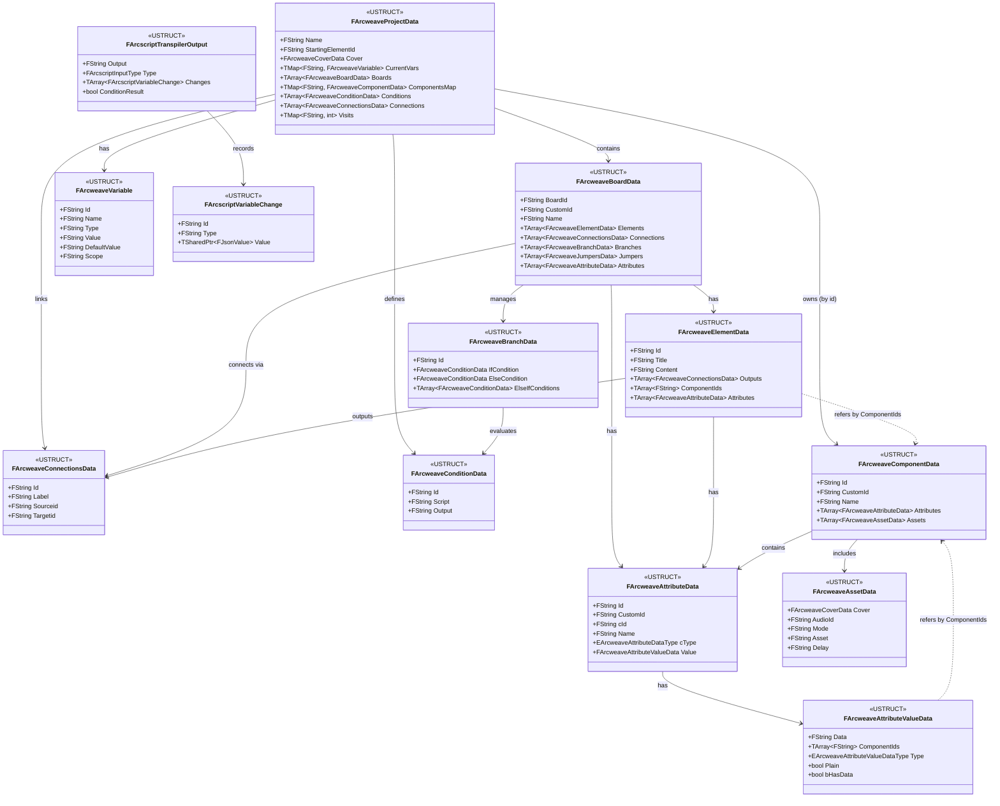

```mermaid
classDiagram
direction TB

class FArcweaveProjectData {
    +FString Name
    +FString StartingElementId
    +FArcweaveCoverData Cover
    +TMap~FString, FArcweaveVariable~ CurrentVars
    +TArray~FArcweaveBoardData~ Boards
    +TMap~FString, FArcweaveComponentData~ ComponentsMap
    +TArray~FArcweaveConditionData~ Conditions
    +TArray~FArcweaveConnectionsData~ Connections
    +TMap~FString, int~ Visits
}

class FArcweaveBoardData {
    +FString BoardId
    +FString CustomId
    +FString Name
    +TArray~FArcweaveElementData~ Elements
    +TArray~FArcweaveConnectionsData~ Connections
    +TArray~FArcweaveBranchData~ Branches
    +TArray~FArcweaveJumpersData~ Jumpers
    +TArray~FArcweaveAttributeData~ Attributes
}

class FArcweaveElementData {
    +FString Id
    +FString Title
    +FString Content
    +TArray~FArcweaveConnectionsData~ Outputs
    +TArray~FString~ ComponentIds
    +TArray~FArcweaveAttributeData~ Attributes
}

class FArcweaveConnectionsData {
    +FString Id
    +FString Label
    +FString Sourceid
    +FString Targetid
}

class FArcweaveVariable {
    +FString Id
    +FString Name
    +FString Type
    +FString Value
    +FString DefaultValue
    +FString Scope
}

class FArcweaveBranchData {
    +FString Id
    +FArcweaveConditionData IfCondition
    +FArcweaveConditionData ElseCondition
    +TArray~FArcweaveConditionData~ ElseIfConditions
}

class FArcweaveConditionData {
    +FString Id
    +FString Script
    +FString Output
}

class FArcweaveComponentData {
    +FString Id
    +FString CustomId
    +FString Name
    +TArray~FArcweaveAttributeData~ Attributes
    +TArray~FArcweaveAssetData~ Assets
}

class FArcscriptTranspilerOutput {
    +FString Output
    +FArcscriptInputType Type
    +TArray~FArcscriptVariableChange~ Changes
    +bool ConditionResult
}

class FArcweaveAttributeData {
    +FString Id
    +FString CustomId
    +FString cId
    +FString Name
    +EArcweaveAttributeDataType cType
    +FArcweaveAttributeValueData Value
}

class FArcweaveAssetData {
    +FArcweaveCoverData Cover
    +FString AudioId
    +FString Mode
    +FString Asset
    +FString Delay
}

class FArcscriptVariableChange {
    +FString Id
    +FString Type
    +TSharedPtr~FJsonValue~ Value
}

class FArcweaveAttributeValueData {
    +FString Data
    +TArray~FString~ ComponentIds
    +EArcweaveAttributeValueDataType Type
    +bool Plain
    +bool bHasData
}

<<USTRUCT>> FArcweaveProjectData
<<USTRUCT>> FArcweaveBoardData
<<USTRUCT>> FArcweaveElementData
<<USTRUCT>> FArcweaveConnectionsData
<<USTRUCT>> FArcweaveVariable
<<USTRUCT>> FArcweaveBranchData
<<USTRUCT>> FArcweaveConditionData
<<USTRUCT>> FArcweaveComponentData
<<USTRUCT>> FArcscriptTranspilerOutput
<<USTRUCT>> FArcweaveAttributeValueData
<<USTRUCT>> FArcweaveAttributeData
<<USTRUCT>> FArcweaveAssetData
<<USTRUCT>> FArcscriptVariableChange

FArcweaveProjectData --> FArcweaveBoardData : contains
FArcweaveProjectData --> FArcweaveVariable : has
FArcweaveProjectData --> FArcweaveComponentData : owns (by id)
FArcweaveProjectData --> FArcweaveConditionData : defines
FArcweaveProjectData --> FArcweaveConnectionsData : links
FArcweaveBoardData --> FArcweaveElementData : has
FArcweaveBoardData --> FArcweaveConnectionsData : connects via
FArcweaveBoardData --> FArcweaveBranchData : manages
FArcweaveBoardData --> FArcweaveAttributeData : has
FArcweaveBranchData --> FArcweaveConditionData : evaluates
FArcweaveElementData --> FArcweaveConnectionsData : outputs
FArcweaveElementData ..> FArcweaveComponentData : refers by ComponentIds
FArcweaveElementData --> FArcweaveAttributeData : has
FArcweaveComponentData --> FArcweaveAttributeData : contains
FArcweaveComponentData --> FArcweaveAssetData : includes
FArcscriptTranspilerOutput --> FArcscriptVariableChange : records
FArcweaveAttributeValueData ..> FArcweaveComponentData : refers by ComponentIds
FArcweaveAttributeData --> FArcweaveAttributeValueData : has
```
